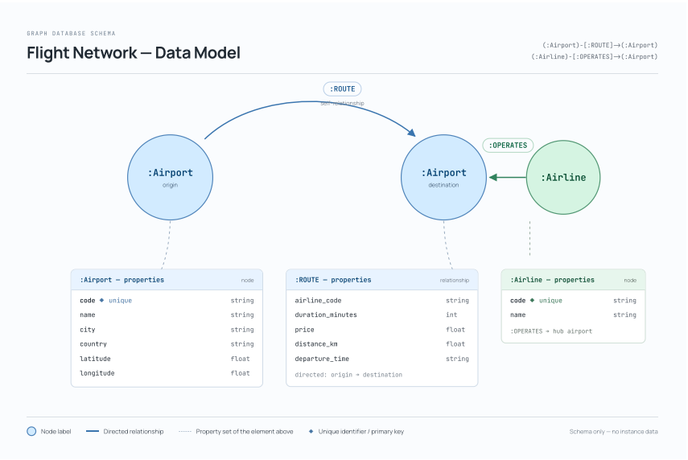
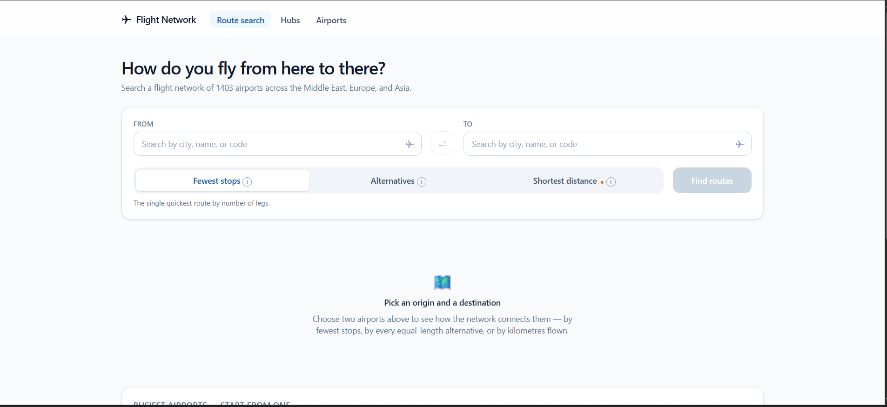
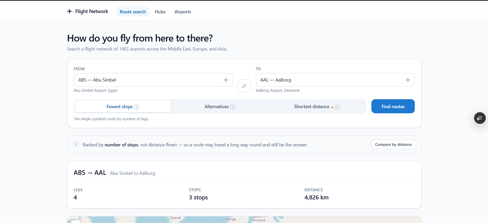
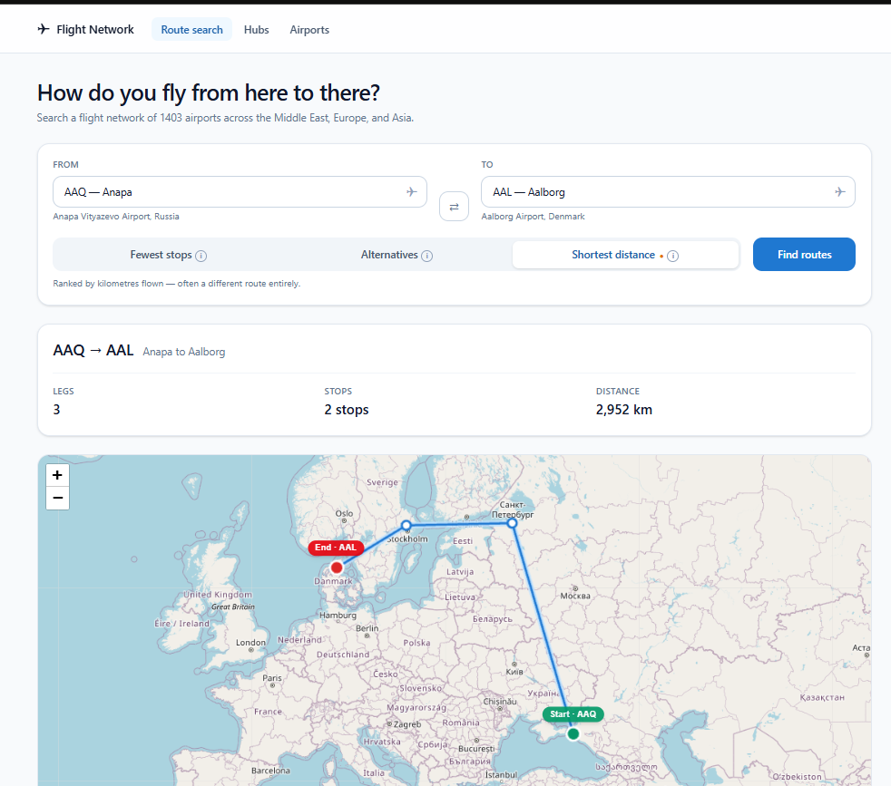
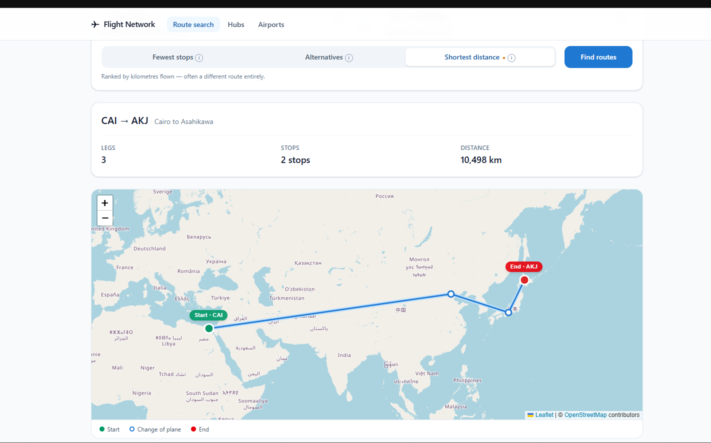
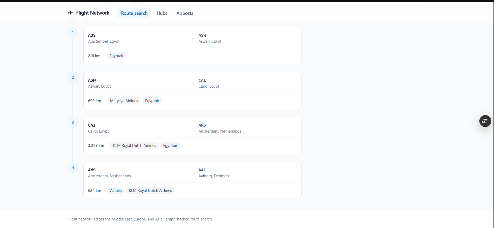
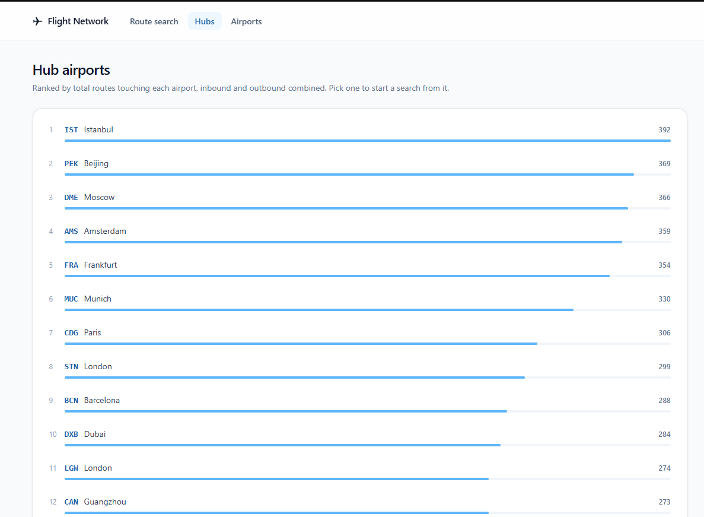
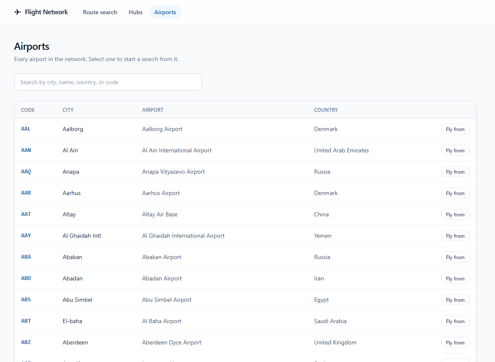

# Flight Network

A graph-database-backed application for exploring flight connectivity between airports — built for the Wexa AI CognoDB take-home assignment.

**Live API:** [https://flightnetwork-api.onrender.com](https://flightnetwork-api.onrender.com) *(hosted on Render's free tier — the first request after a period of inactivity may take a few seconds to wake the instance)*

**Live App:** *(add your Vercel frontend URL here)*

**Demo Video:** [Watch the screen recording](https://drive.google.com/file/d/1AenbRKyBrEOQIW1ClmeOoRdXFatG5-1T/view?usp=sharing)

Given any two airports, the app finds the fastest (fewest-stops) route, alternative routes, the true shortest route by real-world distance, and the most connected ("hub") airports in the network — all powered by native graph traversal rather than relational joins.

---

## Table of Contents

- [Use Case](#use-case)
- [Why a Graph Database?](#why-a-graph-database)
- [Data Model](#data-model)
- [Tech Stack](#tech-stack)
- [Architecture](#architecture)
- [Setup & Run Instructions](#setup--run-instructions)
- [Main Queries Explained](#main-queries-explained)
- [Known Limitations](#known-limitations)
- [Screenshots](#screenshots)

---

## Use Case

**Flight Network** models the global flight route network as a graph: airports as nodes, direct flights as relationships. A user picks an origin and destination airport and can ask:

- What's the quickest route (fewest connections)?
- What alternative routes exist with the same number of stops?
- What's the *actual* shortest route by real-world distance — which may involve more stops than the "fewest-hops" answer?
- Which airports are the most connected hubs in the network?

The dataset is scoped to the **Middle East, Europe, and Asia** region (~1,403 airports, ~334 airlines, ~21,291 direct routes), sourced from [OpenFlights](https://openflights.org/data.html) and filtered to keep the graph dense and meaningful on a free-tier instance.

---

## Why a Graph Database?

Route-finding across an unknown, variable number of connecting flights is exactly the class of problem relational databases handle poorly and graph databases handle natively.

**In SQL**, answering "what's the shortest path from CAI to DLZ, possibly via several connecting airports?" requires a self-join per hop, or a recursive CTE that re-scans growing intermediate result sets at every level — performance degrades sharply as the number of hops grows, and the query has to guess an upper bound on hops in advance.

**In Cypher**, the same question is a single, declarative pattern:

```cypher
MATCH path = shortestPath(
    (origin:Airport {code: $originCode})-[:ROUTE*1..4]->(destination:Airport {code: $destinationCode})
)
RETURN path
```

This isn't just shorter to write — it's fundamentally faster to execute. Neo4j-compatible graph databases use **index-free adjacency**: each node holds direct physical pointers to its relationships, so traversing from one airport to its connected airports is a pointer-follow, not an index lookup or a table scan. Hop count barely affects performance the way it does with repeated SQL joins.

A concrete example from this project's own data makes the distinction between "fewest stops" and "shortest distance" tangible — see [Main Queries Explained](#main-queries-explained) below, where the same origin/destination pair produces two radically different answers depending on which question you ask.

---

## Data Model



### Nodes

**`:Airport`**
| Property | Type | Notes |
|---|---|---|
| `code` | string | IATA code, **unique** |
| `name` | string | |
| `city` | string | |
| `country` | string | |
| `latitude` | float | |
| `longitude` | float | |

**`:Airline`**
| Property | Type | Notes |
|---|---|---|
| `code` | string | IATA code, **unique** |
| `name` | string | |

### Relationship

**`(:Airport)-[:ROUTE]->(:Airport)`** — directed, one relationship per connected airport pair (parallel edges for multiple airlines on the same route are merged into a single relationship).

| Property | Type | Notes |
|---|---|---|
| `airlineCodes` | string[] | every airline operating this route |
| `distanceKm` | float | great-circle (Haversine) distance, computed from airport coordinates at seed time |

> **Note on scope:** the OpenFlights routes dataset describes general route existence, not scheduled flights with fare/time data. There is no `price` or `duration` field in the source data — see [Known Limitations](#known-limitations) for how distance is used as a real, verifiable substitute instead of fabricated pricing.

> **Note on design:** a route is modeled as a direct relationship between two airports rather than as a separate `Flight` node. This keeps the model aligned with what the source data actually represents (a route, not a scheduled flight instance) — a booking-system version of this app would introduce a `Flight` node with real schedule/fare data per departure.

---

## Tech Stack

| Layer | Technology |
|---|---|
| Database | CognoDB (Neo4j-protocol-compatible), accessed via the official `Neo4j.Driver` |
| Backend | ASP.NET Core Web API (.NET 8), N-tier architecture |
| Frontend | React (Vite) |
| Map | react-leaflet |
| Testing | xUnit + Moq (52 unit tests across Services and Api layers) |

---

## Architecture

N-tier, not Clean/Onion architecture — each project depends only on the layer directly beneath it:

```
FlightNetwork.Api  →  FlightNetwork.Services  →  FlightNetwork.DataAccess  →  FlightNetwork.Models
```

- **`FlightNetwork.Models`** — plain POCO entities (`Airport`, `Airline`, `FlightPath`, `FlightLeg`, `HubAirport`). No base classes, no ORM attributes.
- **`FlightNetwork.DataAccess`** — talks to Neo4j directly via `Neo4j.Driver`'s native session/transaction pattern (`ExecuteReadAsync` / `ExecuteWriteAsync`). No Entity Framework, no generic Unit-of-Work abstraction — repositories work directly against Cypher.
- **`FlightNetwork.Services`** — business logic: pagination, airport/airline code normalization (case-insensitive lookups), and orchestration over the repositories.
- **`FlightNetwork.Api`** — controllers, request/response DTOs, AutoMapper profiles, and centralized exception handling (`IExceptionHandler`) that returns clean `400`/`500` responses instead of leaking stack traces.

Connection details (CognoDB URI and password) are read from environment variables / user secrets — never committed to the repository.

---

## Setup & Run Instructions

### 1. Provision a CognoDB instance

1. Sign up at [console.cognodb.com/signup](https://console.cognodb.com/signup) (no credit card required for the free tier).
2. Create a free (**c0**) instance and choose a region.
3. Copy the connection URI (`bolt+s://<instance-id>.databases.cognodb.cloud`) and the generated password for the `cognodb` user — **the password is shown only once**.

### 2. Configure secrets

```bash
cd FlightNetwork.Api
dotnet user-secrets set "Neo4j:Uri" "bolt+s://<instance-id>.databases.cognodb.cloud"
dotnet user-secrets set "Neo4j:User" "cognodb"
dotnet user-secrets set "Neo4j:Password" "<your-password>"
```

### 3. Run the backend

```bash
dotnet build FlightNetwork.slnx
dotnet run --project FlightNetwork.Api
```

On first run, the app automatically:
- applies the schema (uniqueness constraints on `Airport.code` and `Airline.code`)
- seeds the graph from the bundled `airports.json` / `airlines.json` / `routes.json` (idempotent — re-running does nothing if data already exists)

The API is available at `http://localhost:5099` (see console output for the exact port). A hosted version is live at [https://flightnetwork-api.onrender.com](https://flightnetwork-api.onrender.com).

### 4. Run the frontend

```bash
cd frontend
npm install
npm run dev
```

### 5. Run the tests

```bash
dotnet test FlightNetwork.Services.Tests
dotnet test FlightNetwork.Api.Tests
```

---

## Main Queries Explained

### 1. Shortest path (fewest stops)
`GET /api/routes/shortest-path?origin={code}&destination={code}`

```cypher
MATCH path = shortestPath(
    (origin:Airport {code: $originCode})-[:ROUTE*1..4]->(destination:Airport {code: $destinationCode})
)
RETURN path
```
The **multi-hop traversal** requirement: finds a route with the minimum number of connecting flights, up to 4 hops.

### 2. Alternative paths (same fewest-hop count)
`GET /api/routes/alternative-paths?origin={code}&destination={code}&limit={n}`

Uses `allShortestPaths` rather than an unbounded `MATCH`, which is a deliberate performance choice: an unbounded variable-length `MATCH` enumerates *every* possible path before applying `LIMIT`, which exhausted the free-tier instance's memory during testing. `allShortestPaths` only computes paths tied for the minimum hop count, keeping the query fast and safe.

### 3. Shortest path by real distance — the "awkward in SQL" query
`GET /api/routes/shortest-by-distance?origin={code}&destination={code}`

This is the query that best demonstrates why "fewest stops" and "shortest distance" are genuinely different questions — and why the answer requires real graph traversal, not just sorting a fixed-length result:

| Metric | Fewest hops | Shortest distance |
|---|---|---|
| Route (HKT → CXR) | HKT → DME → CXR | HKT → BKK → SGN → CXR |
| Distance | 15,165 km (via Moscow) | **1,699 km** |
| Hops | 2 | 3 |

Phuket and Nha Trang are ~1,700 km apart, yet the fewest-hops route sends the traveler through Moscow — nine times farther. This is implemented as a hop-limited relaxation (Bellman-Ford-style, capped at 3 hops due to instance limits) that accumulates `distanceKm` across candidate paths and keeps the single best path to each airport at each hop count, since Neo4j's built-in `shortestPath`/`allShortestPaths` optimize for hop count, not for a weighted property.

### 4. Hub airports
`GET /api/routes/hubs?limit={n}`

```cypher
MATCH (a:Airport)-[r:ROUTE]-()
RETURN a.code, a.name, count(r) AS totalConnections
ORDER BY totalConnections DESC
LIMIT $limit
```
A simple aggregation over relationship counts — identifies the most-connected airports in the network (e.g. Istanbul, Beijing Capital, Moscow Domodedovo).

All queries use parameterized Cypher (no string concatenation) via the official `Neo4j.Driver`.

---

## Known Limitations

- **No fare/schedule data.** The OpenFlights dataset describes route existence, not live pricing or timing. `distanceKm` (a verifiable, computed value) is used instead of fabricated price data.
- **`shortest-by-distance` is capped at 3 hops.** Testing on the free-tier CognoDB instance showed the 4-hop layer times out; the endpoint returns a `400` for requests beyond this limit rather than failing silently.
- **`shortest-by-distance` is slower (~9–14s)** than the hop-based queries (~1s), due to evaluating multiple candidate paths per hop rather than a single graph traversal. A caching layer would be the natural next step for production use.
- The regional dataset (Middle East, Europe, Asia) means airports outside this scope (e.g. JFK) will correctly return "no route found" rather than an error.

---

## Screenshots

**Empty state — search prompt before any airports are chosen:**


**Fewest-stops result, with the "not distance flown" callout:**


**Same origin/destination, ranked by shortest distance instead — a different route entirely:**


**A long-haul example (Cairo → Asahikawa) showing multi-hop traversal across the network:**


**Alternative paths — every route tied for the fewest number of stops:**


**Hub airports — busiest nodes in the network by total connections:**


**Airports directory — searchable, paginated list of all 1,403 airports:**


**Demo video:** [Watch the screen recording](https://drive.google.com/file/d/1AenbRKyBrEOQIW1ClmeOoRdXFatG5-1T/view?usp=sharing)
